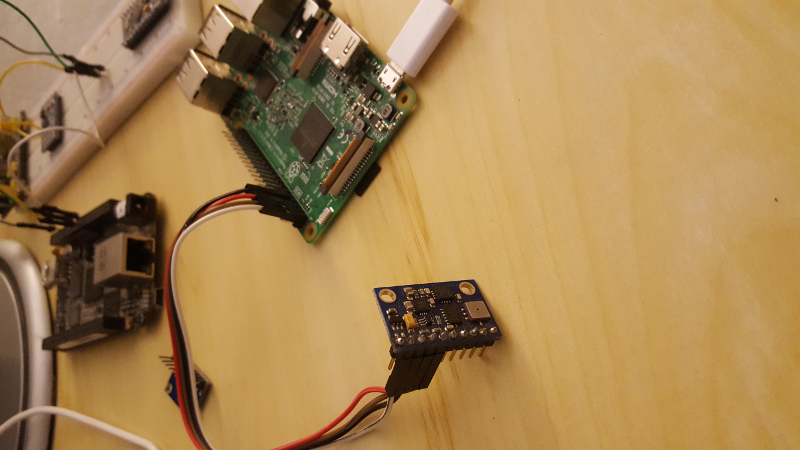
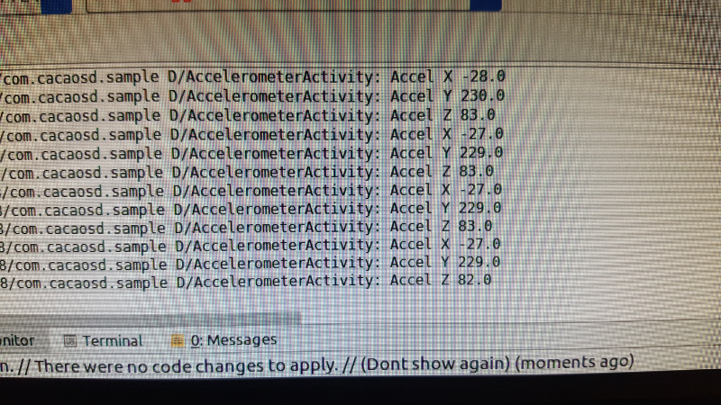

# AndroidThings-ADXL345
ADXL345 3-axis accelerometer AndroidThings device driver.

### Usage
1- Simple usage with create an object and call methods.
```java
        String bus = "device_specific_bus";
        ADXL345 adxl345 = null;
        try {
            adxl345 = new ADXL345(bus);

            Log.i(TAG + " Accel X", String.valueOf(adxl345.getAccelerationX()));
            Log.i(TAG + " Accel Y", String.valueOf(adxl345.getAccelerationY()));
            Log.i(TAG + " Accel Z", String.valueOf(adxl345.getAccelerationZ()));
        } catch (IOException e) {
            e.printStackTrace();
        } finally {
            try {
                if (adxl345 != null) adxl345.close();
            } catch (IOException e) {
                e.printStackTrace();
            }
        }
```

2- There is a sample in this repo like [androidthings](https://github.com/androidthings/drivers-samples) driver samples.

###First Impression



License
-------

      Copyright 2016 Cagdas Caglak

      Licensed under the Apache License, Version 2.0 (the "License");
      you may not use this file except in compliance with the License.
      You may obtain a copy of the License at

      http://www.apache.org/licenses/LICENSE-2.0

      Unless required by applicable law or agreed to in writing, software
      distributed under the License is distributed on an "AS IS" BASIS,
      WITHOUT WARRANTIES OR CONDITIONS OF ANY KIND, either express or implied.
      See the License for the specific language governing permissions and
      limitations under the License.